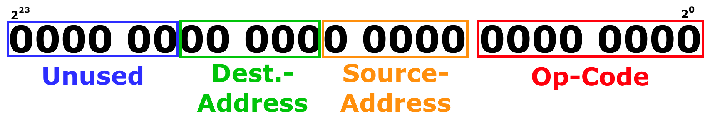

# Instruction Set

I am planning to add a comprehensive instruction set that offers what it takes to port a limited C compiler.

As of now, this is what I came up with:

# 
| OpCode | Instruction | Syntax | Info |
|:------:|:-----------:|--------|------|
| 0x00   | NOP         | NOP | No operation.|
| 0x01   | HALT        | HALT | Indefinitely stops the CPU from executing any further code.|
| 0x02   | MOV         | MOV \<destination\>, \<source\> | Moves values between registers/ expansion ports.|
| 0x03   | LDI         | LDI \<destination\>, \<value \| RAM-addr\> | Loads an immediate value from RAM into the destination register/ expansion port.|
| 0x04   | STR         | STR \<value\>, \<RAM-addr\> | Stores a value from registers, expansion ports or a RAM location into RAM at given address.|
| 0x05   | ADD         | ADD [\<value\>, \<value\>] | Adds two values from registers, expasion ports or RAM locations by placing them into the REA and REB registers. If no values are provided, it adds whatever values are currently in REA and REB. The result is placed in ACC.|
| 0x06   | SUB         | SUB [\<value\>, \<value\>] | " |
| 0x07   | MUL         | MUL [\<value\>, \<value\>] | " |
| 0x08   | DIV         | DIV [\<value\>, \<value\>] | " |
| 0x09   | AND         | AND [\<value\>, \<value\>] | " |
| 0x0A   | OR          | OR [\<value\>, \<value\>] | " |
| 0x0B   | XOR         | XOR [\<value\>, \<value\>] | " |
| 0x0C   | JP          | JP \<label\> | Unconditionally jumps to the label. |
| 0x0D   | JPZ         | JPZ \<label\> | Jumps to the label if the last ALU-Operation triggered the Zero-Flag. |
| 0x0E   | JPC         | JPC \<label\> | Jumps to the label if the last ALU-Operation triggered the Carry-Flag. | 
| 0x0F   | CALL        | CALL \<label\> | Unconditionally jumps to the label, also marks return-address in the stack and increments the stack pointer. |
| 0x10   | RTS         | RTS | Returns to the latest address in stack and decrements the stack pointer. |
| 0x11   | CMP         | CMP \<value\> \<compare\> \<value\>, \<label\> | Jumps to label if operation results in a true value. RTS can be called from the label to return to main routine. |

# Layout
Each instruction is stored ina 24-bit cell.
The first 8 bits contrinute towards the Op-Code.
The following 10 bits count towards the source- and destination addresses of either registers/ expansion ports
the remaining 6 bits are currently un-used.

